# UnrealScience
A software for creating cross-platform 3D presentations. The project has received 3 gold medals in Computer Science.

# Structure
Below is the diagram of the classes in the project
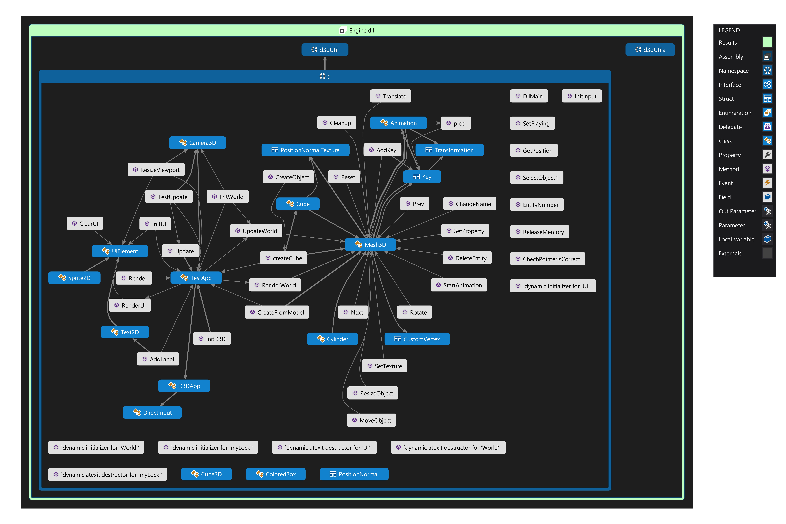

## How would the project be created:
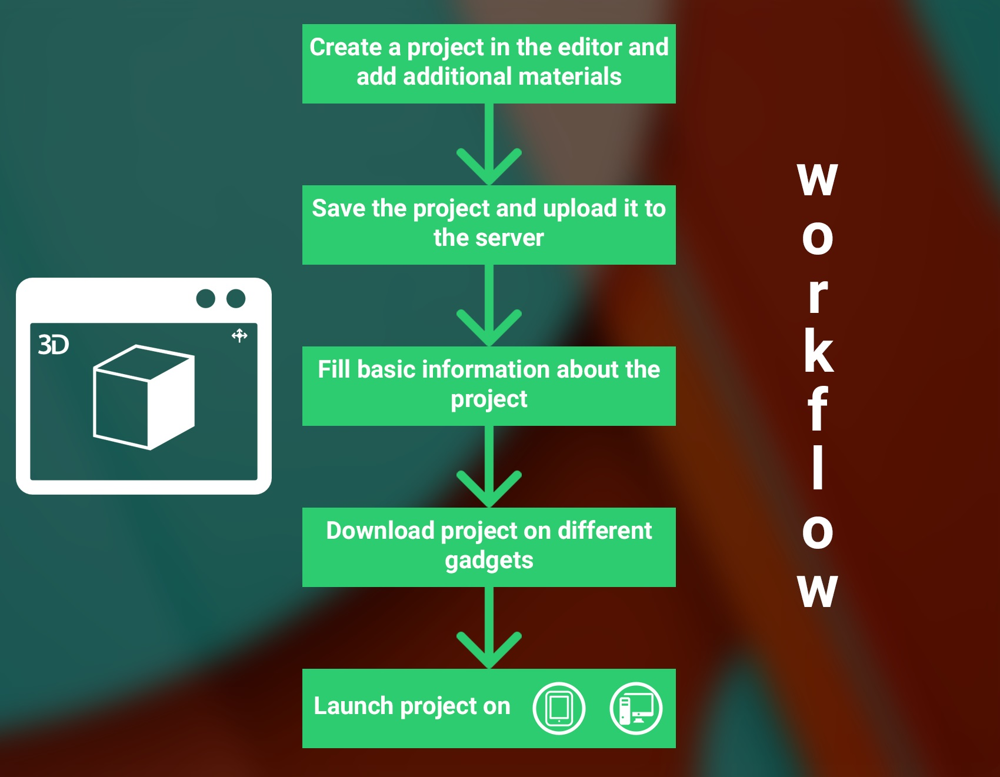

## Screenshots from the editor
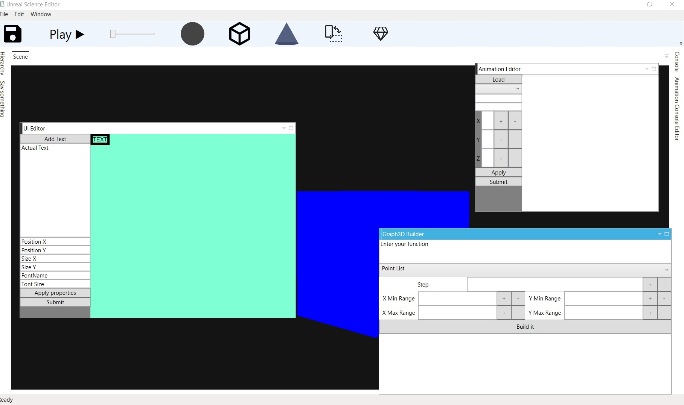
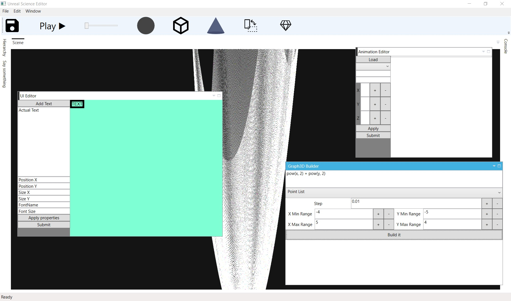

## A few screenshots from the player:
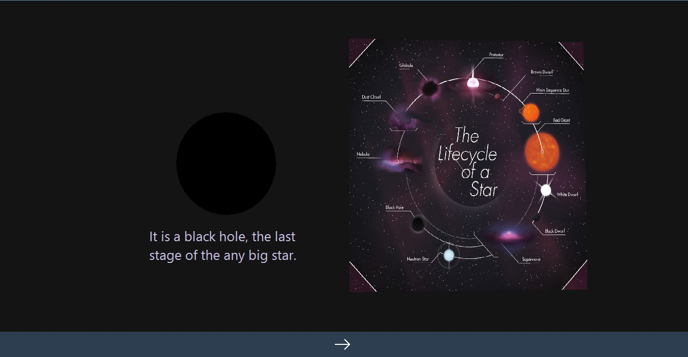
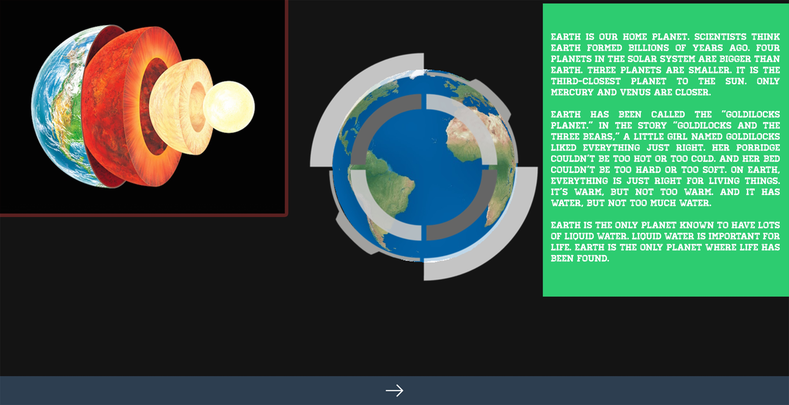
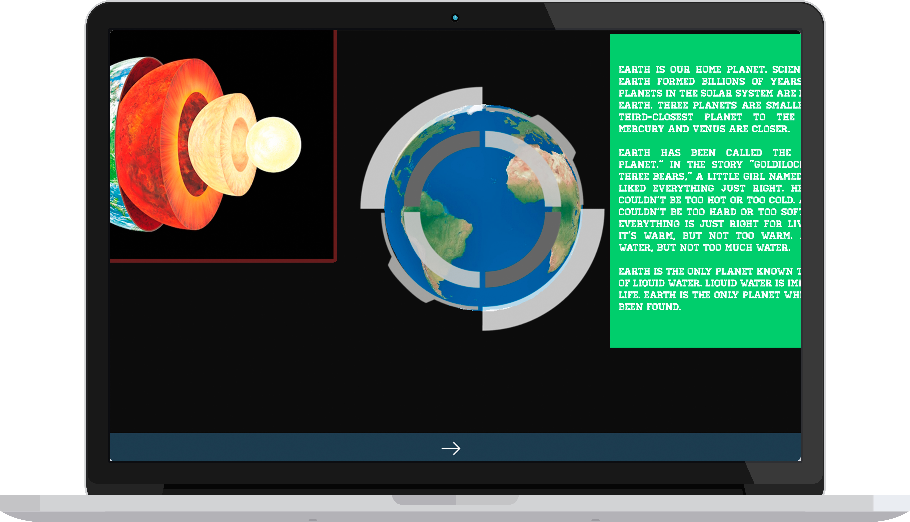
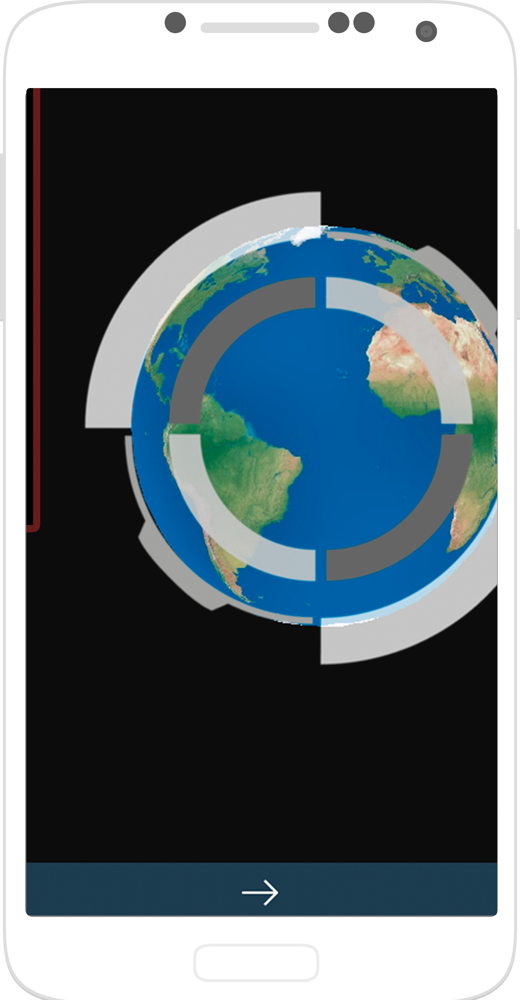
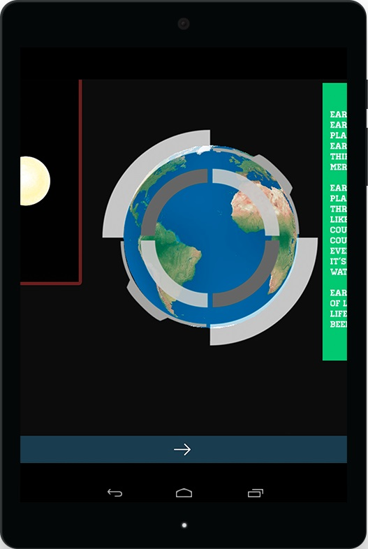

## What features are available:
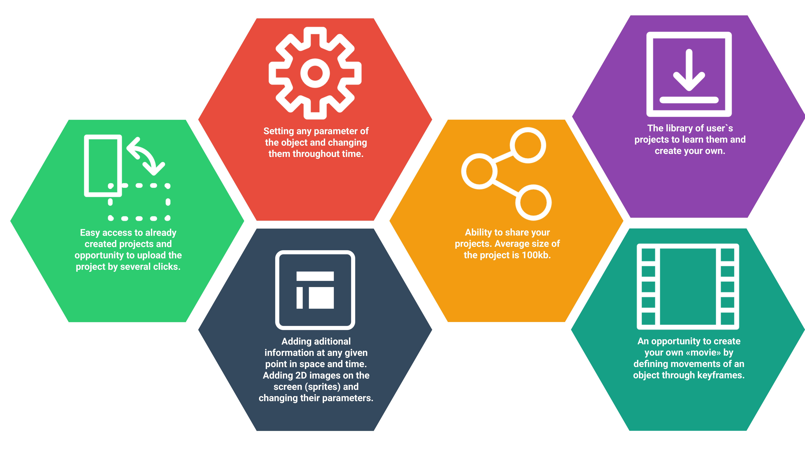

## What is the architecture of the system?
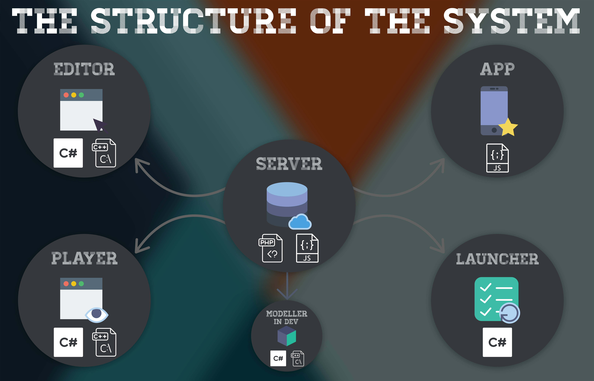

## All the information in the poster
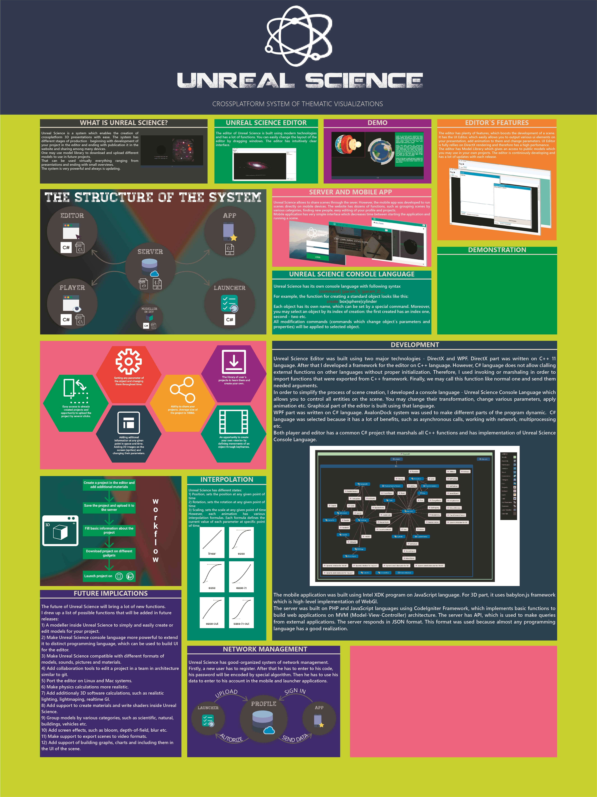
